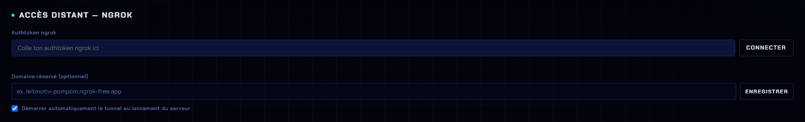

# Multi-PC & accès distant

## Multi-PC (réseau local)

Utilise Leitmotiv sur un PC dédié pendant qu'OBS tourne sur un autre PC du **même réseau**.

1. **Relie les deux PC** au même réseau (Ethernet de préférence, plus stable que le Wi-Fi).
2. **Trouve l'IP** du PC serveur : l'onglet **Paramètres → Multi-PC** liste les IP locales disponibles (ex. `192.168.1.42`).
3. **Sur le PC OBS**, ajoute les Browser Sources avec l'IP à la place de `localhost` :
   ```
   http://192.168.1.42:3002/overlay
   ```
4. Tu peux aussi ouvrir le **panneau** depuis un autre PC : `http://192.168.1.42:3002/control`.


**Pare-feu** : si la connexion échoue, autorise le **port 3002** sur le PC serveur. *Panneau de configuration → Pare-feu Windows → Règles de trafic entrant → Nouvelle règle → Port → TCP 3002 → Autoriser*.



Le panneau n'a **aucune authentification** : toute personne qui atteint `http://<IP>:3002/control` sur le réseau peut piloter le stream. N'ouvre le port que sur un réseau de confiance.


## Accès distant (hors réseau local)

Leitmotiv intègre un **tunnel ngrok** : il expose ton serveur local sur une **URL publique**, joignable depuis n'importe où — sans toucher à ta box ni ouvrir de port sur le routeur.

### À quoi ça sert

| Situation | Ce que ça permet |
| --- | --- |
| **Commentateur à distance** | Il ouvre le panneau ou un overlay depuis chez lui |
| **Régie déportée** | Piloter le scoreboard depuis un autre lieu que la salle |
| **Validation avant l'event** | Montrer un overlay à quelqu'un pour relecture |
| **[Télécommande 3DS](remote-3ds.md)** *(en cours de développement)* | Reporter des scores depuis un autre lieu |

### 1. Récupérer un authtoken ngrok

1. Crée un compte gratuit sur [dashboard.ngrok.com](https://dashboard.ngrok.com).
2. Va dans **Your Authtoken**.
3. Copie le token affiché.

### 2. Connecter le tunnel

Panneau → onglet **Paramètres** → catégorie **Connexions** → section **Accès distant — ngrok**.

<figure><figcaption><p>Colle l'authtoken, clique <strong>Connecter</strong> : l'URL publique apparaît à la place du formulaire.</p></figcaption></figure>

Colle l'authtoken puis clique **Connecter**. Quand le tunnel est actif, la section affiche **« Tunnel actif »**, l'**URL publique**, et deux boutons : **Copier** et **Déconnecter**.

### 3. Utiliser l'URL

L'URL publique **remplace `http://localhost:3002`**. Tout le reste ne change pas :

| En local | À distance |
| --- | --- |
| `http://localhost:3002/control` | `https://<ton-url>.ngrok-free.app/control` |
| `http://localhost:3002/overlay` | `https://<ton-url>.ngrok-free.app/overlay` |

### Domaine réservé (optionnel)

Par défaut, ngrok attribue une **URL différente à chaque démarrage** — il faut la re-communiquer à chaque fois. Un **domaine réservé** (le plan gratuit en propose un) donne une **URL stable** : tu la configures une bonne fois dans l'OBS distant, ou tu la donnes d'avance aux commentateurs.

Renseigne-le dans le champ **Domaine réservé**, au format `mon-asso.ngrok-free.app`, puis **Enregistrer**.

### Démarrage automatique

La case **« Démarrer automatiquement le tunnel au lancement du serveur »** monte le tunnel en même temps que Leitmotiv, sans y penser.


Une URL publique rend ton panneau **accessible depuis Internet**, sans **aucun mot de passe** pour le protéger : quiconque a l'URL peut piloter le stream. Ne la communique qu'aux personnes concernées, et **coupe le tunnel** dès que tu n'en as plus besoin.

Avec le **démarrage automatique** activé, le tunnel monte à chaque lancement — donc ton panneau est exposé en permanence dès que Leitmotiv tourne. À n'activer que si tu en as vraiment l'usage.


### Si le tunnel ne démarre pas

Le message d'erreur s'affiche en rouge sous le champ. Les cas courants :

| Message | Cause | Solution |
| --- | --- | --- |
| **Authtoken invalide** | Token erroné ou expiré | Recopie-le depuis [dashboard.ngrok.com](https://dashboard.ngrok.com) |
| **Authtoken manquant** | Champ vide | Colle le token avant de cliquer Connecter |
| **Trop de tunnels ngrok actifs** | Le plan gratuit en autorise 3 | Ferme les autres sessions ngrok |
| **Le serveur local ne répond pas** | Leitmotiv n'écoute pas sur le port | Vérifie que la fenêtre du serveur est ouverte |
| **Domaine ngrok déjà utilisé** | Un autre process occupe ton domaine réservé | Ferme l'autre instance |
| **Impossible de joindre ngrok** | Réseau ou pare-feu bloquant | Teste la connexion, désactive un VPN |
| **Version de ngrok obsolète** | Module à mettre à jour | `npm update @ngrok/ngrok` |


Pour un usage 24/7 (bot, services de l'asso), on passe plutôt par l'hébergement dédié — mais pour un simple accès ponctuel pendant un event, le tunnel intégré suffit.

