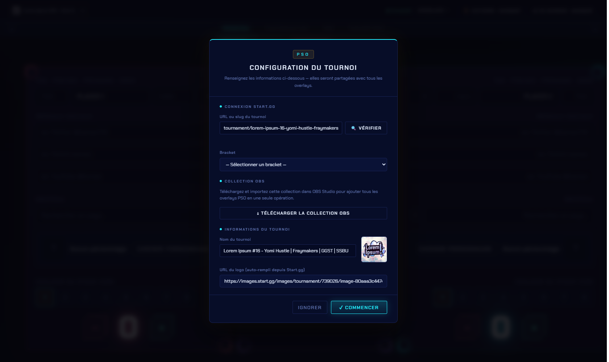

# Configuration du tournoi

Cette fenêtre centralise tout ce qui décrit le tournoi en cours : la connexion start.gg, le bracket, le nom et le logo. Ces informations sont **partagées avec tous les overlays**.

## Ouvrir la fenêtre

* Elle s'ouvre **automatiquement au premier lancement**.
* Ensuite, clique sur le **nom du tournoi en haut à gauche** du panneau pour la rouvrir à tout moment.

<figure><figcaption>
La fenêtre <strong>Configuration du tournoi</strong>, accessible depuis le nom du tournoi en haut à gauche.
</figcaption></figure>

## 1. Connexion start.gg

| Champ | Rôle |
| --- | --- |
| **URL ou slug du tournoi** | Colle l'adresse start.gg du tournoi (ex. `start.gg/tournament/reverie-4`) ou juste son slug (`reverie-4`). |
| **🔍 Vérifier** | Interroge start.gg et récupère le tournoi : son **nom** et son **logo** se remplissent tout seuls plus bas. |
| **Bracket** | Une fois le tournoi trouvé, choisis l'événement à suivre (Smash Ultimate Singles, SF6…). |
| **Phase** *(optionnel)* | Filtre les prochains matchs sur une phase précise. Laisse vide pour toutes les phases. |


Il faut d'abord avoir enregistré ta **clé API start.gg**, sinon la vérification échoue. Voir [Connexion à start.gg](../startgg/connexion.md).


## 2. Collection OBS

Le bouton **↓ Télécharger la collection OBS** génère un fichier à importer dans OBS Studio : il ajoute **tous les overlays d'un coup**, déjà configurés. Gros gain de temps sur un nouveau PC.

Détails : [Configurer OBS](obs.md).

## 3. Informations du tournoi

| Champ | Rôle |
| --- | --- |
| **Nom du tournoi** | Le nom affiché dans le panneau et repris par les overlays. Auto-rempli après vérification, modifiable à la main. |
| **URL du logo** | Auto-remplie depuis start.gg. Tu peux coller une autre URL d'image ; l'aperçu se met à jour à côté. |

## Valider

* **✓ Commencer** enregistre la configuration et ferme la fenêtre.
* **Ignorer** ferme sans enregistrer.


**Changer de tournoi** : recolle le nouveau slug puis clique **Vérifier** — le nom et le logo sont **remplacés** par ceux du nouveau tournoi (le logo peut mettre une seconde à s'afficher, le temps d'être téléchargé).


***

➡️ Ensuite : [Configurer OBS](obs.md)
