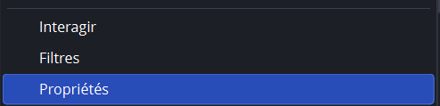
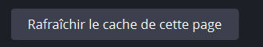

# Configurer OBS

Chaque overlay est une **page web transparente** qu'on ajoute dans OBS en **Source Navigateur** (Browser Source).

## Ajouter un overlay (méthode manuelle)

1. Dans OBS, sous *Sources*, clique **+** → **Source Navigateur** → *Créer*.
2. Dans le champ **URL**, colle l'adresse de l'overlay (voir [Tous les overlays](overlays.md) ou l'onglet **OBS** du panneau).
3. Règle **Largeur = 1920** et **Hauteur = 1080**.
4. Laisse le **CSS personnalisé vide** : la transparence est déjà gérée par l'overlay.
5. Valide.


**Ne coche JAMAIS** « Actualiser le navigateur quand la scène devient active ». Ça coupe les animations et remet l'overlay à zéro en plein set.



Coche **« Fermer la source quand elle n'est pas visible »** uniquement si tu veux économiser des ressources ; sinon laisse décoché pour garder l'état en direct.


## Méthode rapide : importer toute la collection

L'onglet **OBS** du panneau propose un bouton **« Télécharger la collection OBS »**. Il génère un fichier qui, importé dans OBS (*Scènes → Collections de scènes → Importer*), ajoute automatiquement **tous les overlays** déjà configurés. Un énorme gain de temps pour un nouveau PC.

## Ordre des calques recommandé

Dans OBS, la source la plus **haute** dans la liste passe **au-dessus**. Ordre conseillé :

| Position | Overlay | Rôle |
|---|---|---|
| 1 (tout en haut) | **Ticker** | Bandeau d'infos, toujours visible |
| 2 | **Cam / Cadres** | Caméras des joueurs |
| 3 | **Casters** | Commentateurs |
| 4 | **Scoreboard** | Scores et infos du match |
| 5 | **VS Screen / Victoire** | Transitions |
| 6 (tout en bas) | **Fond** | Arrière-plan |


Alternative : l'overlay **[Master](../overlays/master.md)** compose plusieurs overlays dans **une seule** Browser Source. Moins de sources à gérer, moins de charge GPU.


## Placer une webcam sous un overlay Cam

L'overlay **Cam** ne fait qu'afficher le cadre + les infos joueur ; il est transparent au milieu. Dans OBS, place ta **Capture de périphérique vidéo** (webcam / capture 3DS/Switch) **juste en dessous** de la source Cam, et redimensionne-la pour qu'elle rentre dans la zone.

## Dépannage : un overlay ne s'affiche pas

Le réflexe **n°1**, et de loin le plus efficace : **rafraîchir le cache de la source**. OBS garde en mémoire une version de la page, qui peut être périmée — d'où un overlay resté blanc/noir, un ancien contenu affiché, ou un changement qui n'apparaît pas.

1. Dans OBS, **clic droit** sur la source navigateur concernée.
2. Choisis **Propriétés** (tout en bas du menu).
3. En bas de la fenêtre, clique **Rafraîchir le cache de cette page**.
4. Valide avec **OK**.

<figure><figcaption>
Étape 2 : clic droit sur la source → <strong>Propriétés</strong>, tout en bas du menu.
</figcaption></figure>

<figure><figcaption>
Étape 3 : en bas de la fenêtre Propriétés, clique <strong>Rafraîchir le cache de cette page</strong>.
</figcaption></figure>

L'overlay se recharge depuis le serveur Leitmotiv. Dans la grande majorité des cas, c'est réglé.


À faire **systématiquement après une mise à jour** de Leitmotiv (`git pull`) : sinon OBS peut continuer d'afficher l'ancienne version de l'overlay.


Si ça ne suffit pas, vérifie dans l'ordre :

* la **fenêtre noire du serveur** est-elle toujours ouverte ? (sans elle, plus aucun overlay ne fonctionne)
* l'**URL** de la source est-elle la bonne ? (voir [Tous les overlays](overlays.md))
* la taille est-elle bien **1920 × 1080** ?
* le voyant **« Connecté »** est-il vert en haut du panneau ?
* en multi-PC : bonne **IP** et **port 3002 autorisé** dans le pare-feu ? (voir [Multi-PC & accès distant](../avance/multi-pc.md))

---

➡️ Ensuite : [Tous les overlays](overlays.md)
