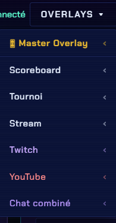

# Tous les overlays

Chaque overlay est une page à ajouter en **Source Navigateur** dans OBS (1920×1080). Préfixe toutes les URLs par `http://localhost:3002` (ou l'IP du PC serveur en multi-PC).


Cette page suit **exactement l'organisation du menu « Overlays ▾ »** du panneau : mêmes catégories, même ordre, mêmes noms. Tu retrouves donc au même endroit ce que tu cherches dans l'appli.


<figure><figcaption>
Le menu <strong>Overlays ▾</strong> du panneau — les sections ci-dessous suivent le même ordre.
</figcaption></figure>

## 🎛 Master Overlay

| Nom | URL | Description |
| --- | --- | --- |
| [Master](../overlays/master.md) | `/master` ou `/master/<id>` | Compose plusieurs overlays en **une seule** source OBS. Le sous-menu liste un lien par master créé. |

## Scoreboard

| Nom | URL | Description |
| --- | --- | --- |
| [Scoreboard](../gerer-un-match-regie/joueurs/README.md) | `/overlay` | Le scoreboard complet : joueurs, personnages, scores, infos du match |
| [VS Screen](../overlays/vs-victory.md) | `/vs-screen` | Écran de présentation d'un set |
| [Cam](../overlays/cam.md) | `/cam` | Cadre caméra + infos joueur |
| [Casters](../gerer-un-match-regie/casters.md) | `/casters` | Noms et réseaux des commentateurs |
| Casters Custom | `/casters-custom` | Layout casters entièrement personnalisé |

## Tournoi

| Nom | URL | Description |
| --- | --- | --- |
| [Stage Veto](../veto/deroulement.md) | `/stageveto` | Sélection de stage en direct |
| [Bracket](../startgg/bracket.md) | `/bracket` | Arbre du bracket |
| [Top 8](../startgg/bracket.md) | `/top8` | Tableau du Top 8 |
| [Historique](../startgg/h2h.md) | `/tournament-history` | Parcours d'un joueur dans le tournoi |
| [Stats joueur](../startgg/h2h.md) | `/player-stats` | Statistiques d'un joueur |
| [H2H](../startgg/h2h.md) | `/h2h` | Confrontation directe entre deux joueurs |

## Stream

| Nom | URL | Description |
| --- | --- | --- |
| Titre | `/stream-title` | Titre / sous-titre affiché à l'écran |
| [Bandeau](../overlays/ticker.md) | `/ticker` | Informations qui défilent |
| [Cadres](../overlays/frames.md) | `/frames` | Jusqu'à 6 cadres décoratifs |
| [Timer](../overlays/timer.md) | `/timer` | Compte à rebours / chronomètre |
| [🎮 Stream Deck URLs](../avance/stream-deck.md) | `/deck` | La liste des URLs à coller sur tes boutons Stream Deck |

## Twitch

| Nom | URL | Description |
| --- | --- | --- |
| [Layout](../overlays/next.md) | `/nextmatch` | Le prochain match (bandeau « à suivre ») |
| Viewers | `/twitch-viewer` | Compteur de viewers |
| [Alertes](../plateformes/chat.md) | `/twitch-alerts` | Follows, subs, raids, bits |
| [Chat](../plateformes/chat.md) | `/twitch-chat` | Chat Twitch en overlay |

Connexion et réglages : [Twitch](../plateformes/twitch.md).

## YouTube

| Nom | URL | Description |
| --- | --- | --- |
| [Chat](../plateformes/chat.md) | `/youtube-chat` | Chat YouTube en overlay |
| Viewers | `/youtube-viewer` | Compteur de viewers |
| [Alertes](../plateformes/chat.md) | `/youtube-alerts` | Super Chats, nouveaux membres, paliers |

Connexion et réglages : [YouTube](../plateformes/youtube.md).

## Chat combiné

| Nom | URL | Description |
| --- | --- | --- |
| [Twitch + YouTube](../plateformes/chat.md) | `/combined-chat` | Les deux chats fusionnés, avec un badge de couleur par plateforme |

## Autres pages (hors menu)

Accessibles directement par leur URL, même si elles ne figurent pas dans le menu **Overlays ▾** :

| Nom | URL | Description |
| --- | --- | --- |
| Scoreboard Slim | `/overlay-slim` | Version barre compacte du scoreboard |
| [Victoire](../overlays/vs-victory.md) | `/victory` | Écran de fin de set (piloté par le bouton 🏆 de l'en-tête) |
| [Prochains matchs](../overlays/next.md) | `/upcoming` | File des matchs à venir |
| Stingers | `/stinger-*` | Une soixantaine de transitions animées (ex. `/stinger-cyberpunk`) |
| [Régie](../avance/regie.md) | `/regie` | Panneau de contrôle allégé, sur 3 colonnes |
| Notes | `/notes` | Bloc-notes / rundown pour le staff |
| AV Sync | `/avsync` | Mire pour régler la synchro audio/vidéo |
| Créateur de scoreboard | `/scoreboard-custom` | Scoreboard entièrement personnalisé |
| Ce guide | `/guide` | Version intégrée à l'appli |


Tu n'as pas besoin d'ajouter **tous** ces overlays dans OBS. Choisis ceux dont tu te sers vraiment pour ton format de stream.

