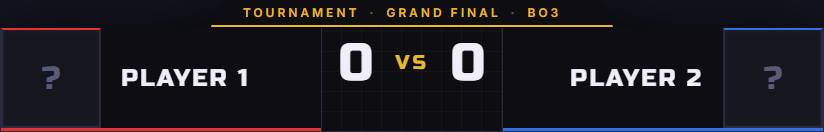
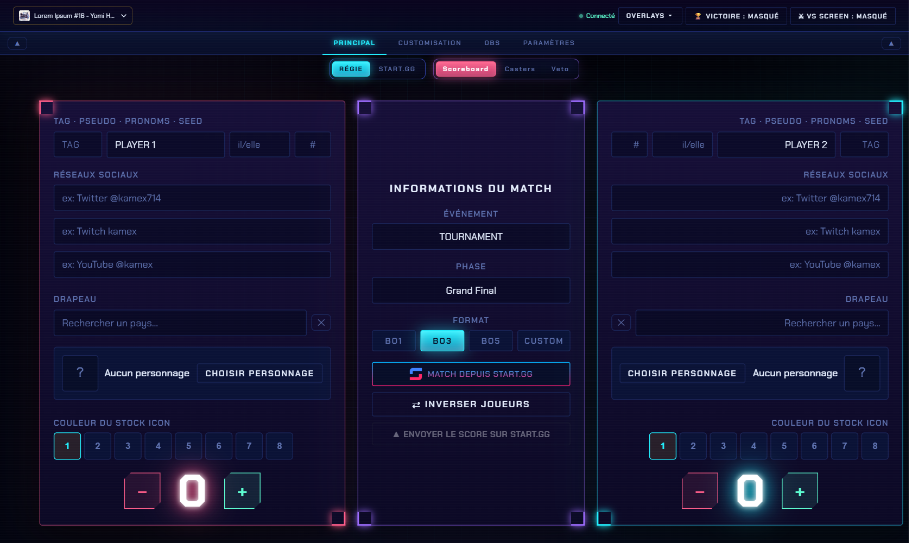

# Scoreboard

Tout se passe dans l'onglet **Principal** du panneau. C'est là que tu remplis les deux joueurs affichés sur le scoreboard.

<figure><figcaption>
Le scoreboard tel qu'il s'affiche à l'écran (données par défaut).
</figcaption></figure>


Le plus souvent, tu ne remplis **pas** ça à la main : tu **charges le set depuis start.gg** et les deux joueurs se remplissent tout seuls. Voir [Charger un set](../../startgg/charger.md).


L'onglet **Principal** est organisé en deux zones, chacune détaillée dans sa page :

* [**Panneau de gauche/droite**](les-joueurs.md) — l'identité des deux joueurs (tag, pseudo, personnage, drapeau, réseaux…), le score et l'inversion des joueurs.
* [**Panneau du milieu**](infos-du-match.md) — les infos du match (événement, phase, format) et l'intégration start.gg (envoi du score, chargement d'un set, Stream Deck).

<figure><figcaption>
L'onglet <strong>Principal</strong> : panneaux joueurs à gauche/droite, informations du match au milieu.
</figcaption></figure>

***

➡️ Ensuite : [Panneau de gauche/droite](les-joueurs.md)
