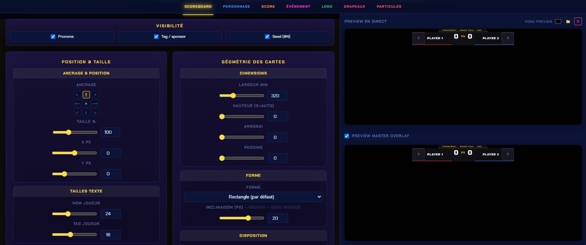

# Customisation

## Où ça se règle

Panneau → onglet **Customisation** → catégorie **SSBU** → **Scoreboard**.

<figure><figcaption>
Les réglages à gauche, deux aperçus en direct à droite.
</figcaption></figure>


Les sous-encadrés (**Ancrage & position**, **Fond du scoreboard**, **Contour**…) sont **repliés par défaut** pour que tout tienne à l'écran. Clique le titre — ou le petit chevron à sa gauche — pour déplier, re-clique pour replier. Les bascules **Off/On** logées dans certains titres restent utilisables sans déplier.


## Les sept onglets

| Onglet | Contenu |
| --- | --- |
| **Scoreboard** | **Visibilité** des champs (pronoms, tag/sponsor, seed), **Position & taille** (ancrage, X/Y, tailles de texte), **Géométrie des cartes** (dimensions, arrondi, forme, inclinaison, disposition), fond, couleurs et effets |
| **Personnage** | Affichage des personnages : taille, position |
| **Score** | Le chiffre du score : taille, alignement, décalage, et le carré derrière |
| **Événement** | La barre du haut : texte, taille, style de la barre |
| **Logo** | Le logo central : image, taille, opacité, masquage |
| **Drapeaux** | Affichage et position des drapeaux |
| **Particules** | Type de particules et teinte |

### Position du score

Dans l'onglet **Score**, le réglage **Position** place le chiffre :

| Option | Où se place le score |
| --- | --- |
| **⇆ Entre** *(défaut)* | Au centre de la barre, de part et d'autre du VS |
| **↑ Au-dessus** | Au-dessus des cartes joueurs |
| **📦 Cartes (centre)** | Dans les cartes, chaque score poussé vers le centre de la barre |
| **◨◧ Cartes (extérieur)** | Dans les cartes, mais vers l'**extérieur** : score de P1 tout à gauche, score de P2 tout à droite |

Les modes « cartes » rapprochent le score du joueur concerné, à la façon d'un scoreboard TSH. **Centre** et **extérieur** sont exactement inverses : le premier ramène les scores vers le logo, le second les envoie aux deux bouts de la barre.

### Débordement du texte

Dans l'onglet **Scoreboard** → **Géométrie des cartes** → **Débordement du texte**, le menu **« Si le texte est plus grand que la carte »** propose trois comportements :

| Option | Carte joueur | Texte |
| --- | --- | --- |
| **Agrandir la carte** *(défaut)* | S'élargit pour tout contenir | Taille inchangée |
| **Aplatir le texte** | Reste à la **largeur min** | **Comprimé** horizontalement |
| **Rétrécir le texte (…)** | Reste à la **largeur min** | **Coupé**, suivi de points de suspension |

Avec « Aplatir » et « Rétrécir », les deux cartes gardent la même largeur : la barre reste **symétrique** et le VS naturellement centré, quelle que soit la longueur des pseudos.


Les deux ont un défaut opposé : **Aplatir** garde le pseudo entier mais le déforme (très condensé sur un nom long), **Rétrécir** garde la typo intacte mais perd la fin du pseudo. Si aucun des deux ne convient, augmente plutôt la **largeur min**.


### Le logo qui dépasse

Dans l'onglet **Logo**, la case **« Le logo dépasse (survole le scoreboard) »** fait deux choses :

* le logo peut **sortir des cartes** au lieu d'être rogné par leurs bords ;
* il devient **indépendant des décalages X px / Y px** de la barre : quand tu déplaces le scoreboard, le logo **garde sa position à l'écran**.


Le **VS** n'est pas concerné : il reste solidaire de la barre (et il est de toute façon masqué dès qu'un logo est posé).


### Ancrer le logo à l'écran

Toujours dans l'onglet **Logo**, une grille d'**ancrage à l'écran** en 9 points, identique à celle du scoreboard, permet de sortir complètement le logo de la barre : coin haut-gauche, centre, bas-droite… Les champs **Décalage X / Y px** ajustent finement depuis le point choisi (X+ vers la droite, Y+ vers le bas).

Pratique pour un **logo de tournoi posé dans un coin du stream**, qui ne bouge plus du tout quand tu recales le scoreboard.


Deux conditions :

* l'ancrage n'agit que si la case **« Le logo dépasse »** est cochée ;
* **aucun point sélectionné** = comportement par défaut, le logo reste centré sur la barre. Re-clique le point actif pour le désélectionner et revenir à ce mode.


### Centrage horizontal

Dans l'onglet **Scoreboard** → **Position & taille** → **Ancrage & position**, deux modes :

| Mode | Ce qui est aligné sur le centre de l'écran |
| --- | --- |
| **Barre entière** *(défaut)* | Le bloc scoreboard dans son ensemble |
| **Logo / VS** | Le bloc central (VS / logo) — la barre se décale en conséquence |

Les deux donnent le même résultat quand les deux joueurs ont la même largeur. Dès que ce n'est plus le cas (un pseudo bien plus long que l'autre), la barre devient **asymétrique** : centrer la barre décale visuellement le VS, alors que le mode **Logo / VS** le remet pile au milieu de l'image.


Sans effet si l'ancrage choisi n'est pas un ancrage **centré** (haut-centre, centre, bas-centre).


## Les aperçus en direct

Deux aperçus, à droite du panneau :

* **Preview en direct** — le scoreboard seul, tel qu'il sortira ;
* **Preview master overlay** — le même, replacé dans ton [master overlay](../../overlays/master.md), pour vérifier qu'il ne chevauche pas un autre calque.


Tu peux changer le **fond de l'aperçu** (bouton *Fond preview*) pour juger le rendu sur une image de gameplay plutôt que sur du noir.


## Thèmes et presets

Les **couleurs** viennent du [thème](../../apparence/themes.md) actif (ou de ton [thème custom](../../apparence/theme-custom.md)) et s'appliquent à tous les overlays d'un coup.

Une fois ton scoreboard réglé, enregistre l'ensemble comme [preset de scoreboard](../../apparence/presets.md) pour le retrouver en un clic.
