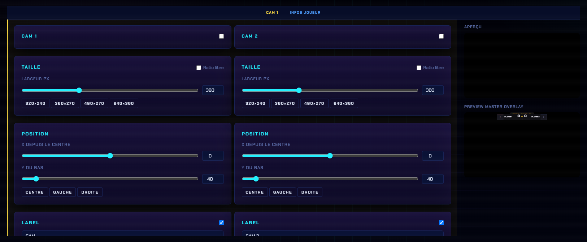
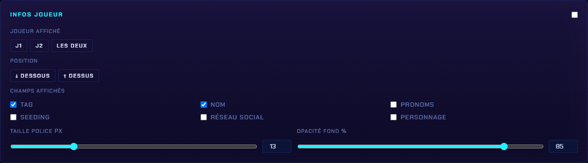

# Customisation

## Où ça se règle

Panneau → onglet **Customisation** → catégorie **Générique** → **Cam**.

C'est la même barre qui donne accès aux autres overlays génériques : **Cam · Cadres · Titre · Bandeau · Minuteur · Test A/V**.

<figure><figcaption>
Les deux caméras se règlent côte à côte, avec un <strong>aperçu</strong> à droite.
</figcaption></figure>

En haut du panneau, deux raccourcis pratiques : **📋 OBS** copie l'URL à coller dans OBS, et **Ouvrir ↗** ouvre l'overlay dans un onglet.

## Réglages de chaque caméra

**CAM 1** et **CAM 2** ont chacune leur case d'activation et les mêmes réglages, indépendants :

| Réglage | Détail |
| --- | --- |
| **Taille** | Slider **Largeur px** + champ numérique, et 4 presets : `320×240`, `360×270`, `480×270`, `640×360` |
| **Ratio libre** | Décoché (par défaut), les proportions sont conservées. Coche-le pour régler largeur et hauteur indépendamment |
| **Position** | **X depuis le centre** et **Y du bas**, plus trois presets : **Centre**, **Gauche**, **Droite** |
| **Label** | Une case pour l'afficher + le texte du cadre (ex. `CAM`, `CAM 2`) |

## Infos joueur

Un bloc commun aux deux cams, activable par son interrupteur :

<figure><figcaption>
Le bloc <strong>Infos joueur</strong> : qui afficher, où, et quels champs.
</figcaption></figure>

| Réglage | Détail |
| --- | --- |
| **Joueur affiché** | **J1**, **J2** ou **Les deux** |
| **Position** | **↓ Dessous** ou **↑ Dessus** du cadre |
| **Champs affichés** | Tag, Nom, Pronoms, Seeding, Réseau social, Personnage — à cocher au choix |
| **Taille police px** | Taille du texte des infos |
| **Opacité fond %** | Transparence du bandeau derrière le texte |


L'**aperçu** à droite du panneau montre le rendu en direct : tu peux régler taille et position sans aller vérifier dans OBS.

