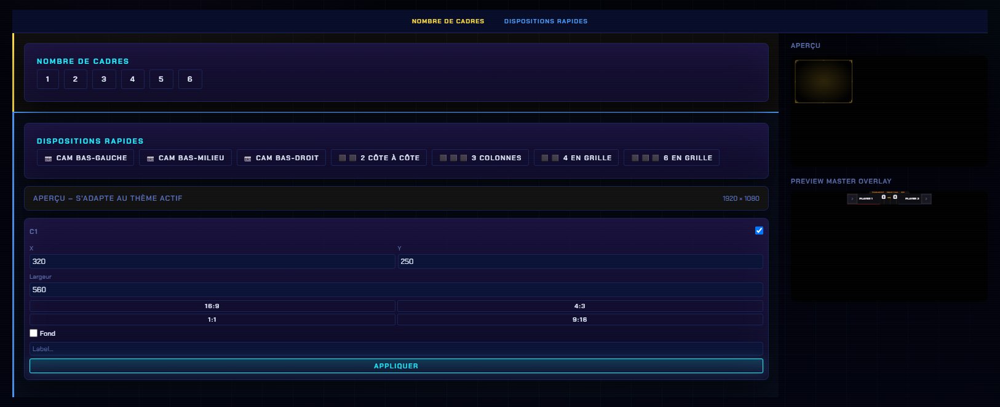

# Customisation

## Où ça se règle

Panneau → onglet **Customisation** → catégorie **Générique** → **Cadres**.

<figure><figcaption>
Nombre de cadres, dispositions rapides, puis une carte de réglages par cadre.
</figcaption></figure>

## Nombre de cadres

Six boutons, de **1** à **6** : choisis combien de cadres sont affichés.

## Dispositions rapides

Sept presets qui placent les cadres pour toi :

| Preset | Usage |
| --- | --- |
| **Cam bas-gauche / bas-milieu / bas-droit** | Une seule caméra, posée dans un coin |
| **2 côte à côte** | Un 1v1 avec les deux joueurs |
| **3 colonnes** | Trois setups en ligne |
| **4 en grille** / **6 en grille** | Pools filmées, plusieurs postes |

## Réglages de chaque cadre

Chaque cadre a sa carte (**C1**, **C2**…), avec sa case d'activation :

| Réglage | Détail |
| --- | --- |
| **X** / **Y** | Position du cadre |
| **Largeur** | Largeur en pixels |
| **Ratio** | Quatre boutons : `16:9`, `4:3`, `1:1`, `9:16` — la hauteur suit |
| **Fond** | Ajoute un fond derrière le cadre (sinon totalement transparent) |
| **Label** | Texte affiché sur le cadre (ex. `Player 1`) |


Chaque carte a son bouton **Appliquer** : les valeurs saisies ne partent pas à la volée, valide-les.



L'**aperçu** à droite montre le rendu en direct, thème compris.

