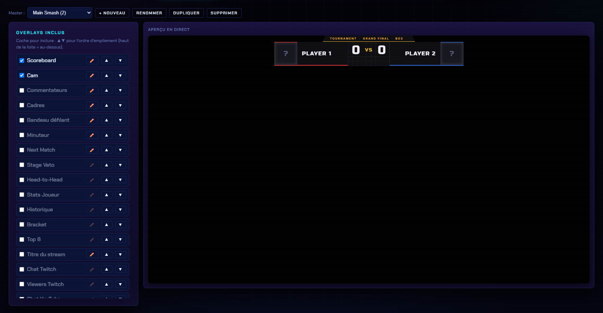
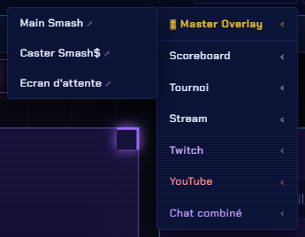

# Master (tout-en-un)

L'overlay **Master** compose **plusieurs overlays en une seule** Source Navigateur OBS. Au lieu d'empiler 8–10 sources, tu as **une seule** source par scène.

## Pourquoi l'utiliser

* **Moins de sources** à gérer dans OBS.
* **Moins de charge GPU** et moins de risque de décalage entre calques.
* Une **scène = une URL** : tu bascules de scène dans OBS en changeant de source.

## Où ça se règle

Panneau → onglet **OBS** → sous-onglet **Master overlay**.


Contrairement aux autres overlays, qui se règlent dans **Customisation**, le Master se configure dans l'onglet **OBS** : c'est un outil de composition pour OBS, pas un réglage d'apparence.


<figure><figcaption>
À gauche la liste des <strong>overlays inclus</strong>, à droite l'<strong>aperçu en direct</strong> du master.
</figcaption></figure>

## Composer une scène master

Dans la colonne **Overlays inclus** :

* **Coche** un overlay pour l'ajouter au master (décoche pour le retirer).
* Les flèches **▲ ▼** règlent l'**ordre d'empilement** — *haut de la liste = affiché au-dessus*.
* Le **crayon ✏️** ouvre les réglages du calque (position, taille…).

L'**aperçu en direct**, à droite, montre le rendu réel du master pendant que tu le composes : pas besoin d'aller vérifier dans OBS.

## Gérer plusieurs masters

La barre du haut permet d'en avoir autant que tu veux :

| Bouton | Effet |
| --- | --- |
| **+ Nouveau** | Crée un master vide |
| **Renommer** | Change son nom (celui affiché dans le menu et le sélecteur) |
| **Dupliquer** | Copie le master courant — pratique pour décliner une variante |
| **Supprimer** | Supprime le master sélectionné |

Chaque master est **indépendant** et persiste au redémarrage du serveur.

## URLs

* `/master` — suit le master « courant ».
* `/master/<id>` — une scène master précise (ex. `/master/m3`).

Les liens exacts sont listés dans le menu **Overlays ▾ → 🎛 Master Overlay** en haut du panneau : un lien par master créé.

<figure><figcaption>
Chaque master a son propre lien, prêt à coller dans une Source Navigateur OBS.
</figcaption></figure>


Approche recommandée pour OBS : crée un master par **scène type** (ex. « Match », « Écran d'attente », « Casters »), ajoute chacun comme une Browser Source dans la scène OBS correspondante, et tu changes d'ambiance en changeant de scène OBS.



Le Master est puissant mais moins souple qu'OBS pour repositionner à la volée. Si tu bouges souvent une source pendant le live, garde-la en source OBS séparée plutôt que dans le master.

