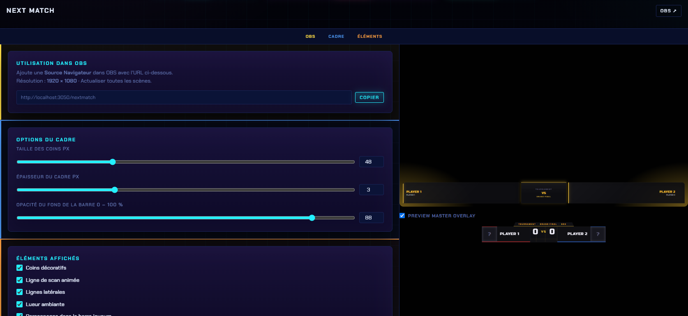

# Customisation

## Où ça se règle

Panneau → onglet **Customisation** → catégorie **SSBU** → **Next Match**.

Le panneau a trois sections : **OBS · Cadre · Éléments**.

<figure><figcaption>
Les réglages à gauche, l'aperçu du bandeau à droite.
</figcaption></figure>

## OBS

L'**URL de l'overlay** avec un bouton **Copier**, et le rappel de la résolution (1920 × 1080).

## Options du cadre

| Réglage | Détail |
| --- | --- |
| **Taille des coins (px)** | Longueur des coins décoratifs |
| **Épaisseur du cadre (px)** | Trait du cadre |
| **Opacité du fond de la barre** | De 0 à 100 % |

## Éléments affichés

Des cases à cocher pour composer le bandeau :

* **Coins décoratifs**
* **Ligne de scan animée**
* **Lignes latérales**
* **Lueur ambiante** (avec réglages d'intensité et de couleur)
* **Personnages dans la barre joueurs**


L'overlay **Prochains matchs** (`/upcoming`) n'a pas de panneau de réglages dédié : il suit le thème actif et la file de sets start.gg.

