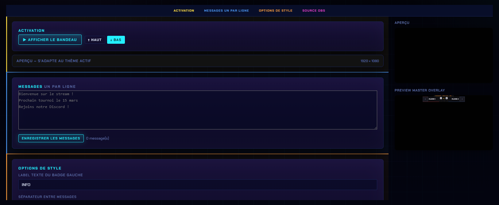
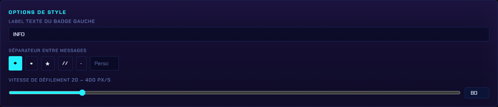

# Customisation

## Où ça se règle

Panneau → onglet **Customisation** → catégorie **Générique** → **Bandeau**.

Le panneau est découpé en quatre sections : **Activation · Messages · Options de style · Source OBS**.

<figure><figcaption>
Activation en haut, saisie des messages en dessous, et un aperçu à droite.
</figcaption></figure>

## Les messages

Tape **un message par ligne** dans la zone de texte.


Les messages ne sont pas pris en compte à la volée : clique **Enregistrer les messages** pour les valider. Le compteur à côté du bouton indique combien de messages sont réellement enregistrés — s'il affiche `0 message(s)`, rien ne défilera.


## Options de style

<figure><figcaption>
Badge de gauche, séparateur et vitesse de défilement.
</figcaption></figure>

| Réglage | Détail |
| --- | --- |
| **Label du badge gauche** | Le texte fixe affiché à gauche de la bande (par défaut `INFO`) |
| **Séparateur entre messages** | Au choix : `◆`, `▪`, `★`, `//`, `·`, ou **Perso** pour saisir le tien |
| **Vitesse de défilement** | Slider de **20 à 400 px/s** (80 par défaut) |

## Source OBS

La dernière section donne l'**URL de l'overlay** à coller dans une Source Navigateur OBS.


L'**aperçu** à droite du panneau montre le rendu en direct, thème compris : tu peux régler la vitesse et le séparateur sans aller vérifier dans OBS.

