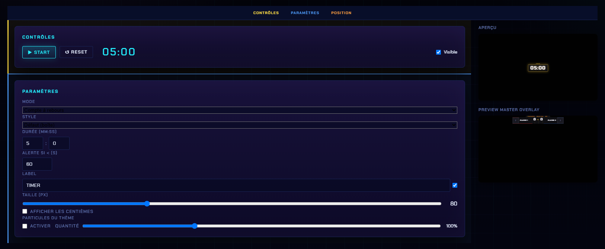

# Customisation

## Où ça se règle

Panneau → onglet **Customisation** → catégorie **Générique** → **Minuteur**.

Le panneau a trois sections : **Contrôles · Paramètres · Position**.

<figure><figcaption>
Les contrôles en haut, les paramètres en dessous, et l'aperçu en direct à droite.
</figcaption></figure>

## Paramètres

| Réglage | Détail |
| --- | --- |
| **Mode** | Compte à rebours ou chronomètre |
| **Style** | L'apparence du minuteur |
| **Durée (MM:SS)** | Le point de départ du compte à rebours (deux champs : minutes et secondes) |
| **Alerte si < (s)** | Seuil en secondes à partir duquel l'affichage passe en mode alerte |
| **Label** | Le texte au-dessus des chiffres (ex. `TIMER`), avec une case pour l'afficher ou non |
| **Taille (px)** | Taille des chiffres |
| **Afficher les centièmes** | Ajoute les centièmes de seconde |
| **Particules du thème** | Case **Activer** + slider de **quantité** |

## Position

La section **Position** place le minuteur sur l'écran 1920 × 1080.


L'**aperçu** à droite montre le rendu réel, thème et particules compris.

