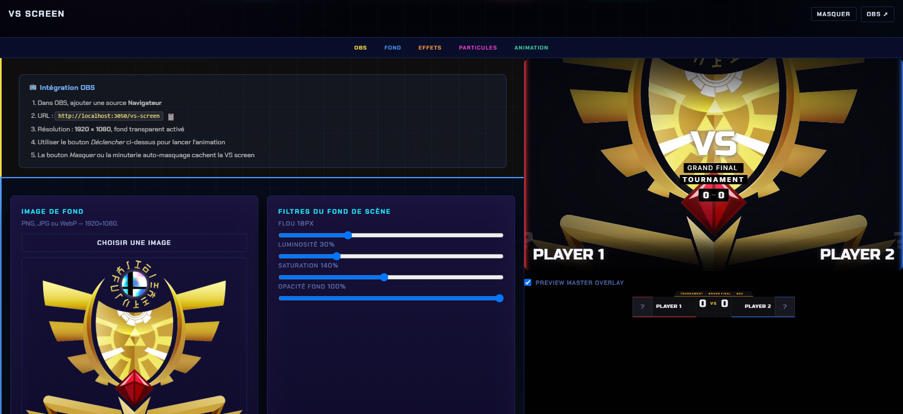
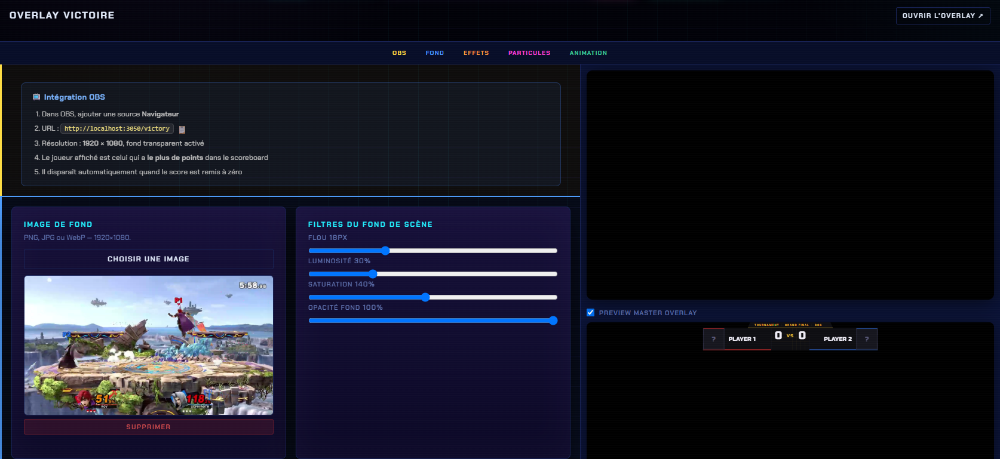

# Customisation

## Où ça se règle

Panneau → onglet **Customisation** → catégorie **SSBU** → **VS Screen** ou **Victory**.

Les deux overlays ont **exactement le même panneau de réglages**, découpé en cinq sections :

| Section | Contenu |
| --- | --- |
| **OBS** | Le rappel d'intégration : URL à coller, résolution 1920 × 1080, fond transparent |
| **Fond** | **Image de fond** (PNG/JPG/WebP en 1920×1080) et **filtres** : flou, luminosité, saturation, opacité |
| **Effets** | Vignette, scanlines, teinte de couleur |
| **Particules** | Les particules du thème en surcouche |
| **Animation** | Animations d'entrée/sortie et **minuterie d'auto-masquage** |

## VS Screen

<figure><figcaption>
Réglages du VS Screen, avec l'aperçu en direct à droite. (L'URL affichée dépend du port ; chez toi c'est <code>3002</code>.)
</figcaption></figure>

## Overlay Victoire

<figure><figcaption>
Réglages de l'overlay Victoire — ici avec une image de fond personnalisée.
</figcaption></figure>


L'**aperçu en direct** à droite montre le rendu réel pendant que tu règles : pas besoin d'aller vérifier dans OBS.

Pense aussi à régler une **minuterie d'auto-masquage** (ex. 5–8 s) : l'écran se retire tout seul, tu n'as pas à y penser en plein live.

