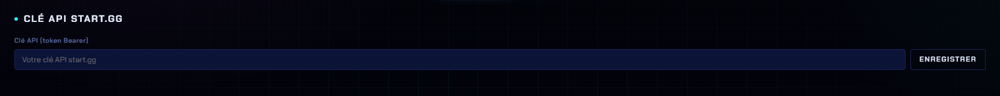
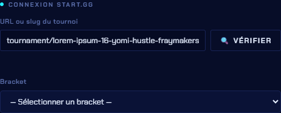

# Connexion à start.gg

start.gg est **la source de vérité** de nos tournois. Leitmotiv s'y connecte pour :

* charger automatiquement les participants et les sets,
* remplir le scoreboard en un clic,
* renvoyer les résultats sur la plateforme,
* calculer les Head-to-Head, stats et brackets.

## 1. Obtenir une clé API


La clé API est **personnelle et secrète**. Elle donne accès à ton compte start.gg. Ne la partage pas, ne la mets pas sur GitHub. Dans Leitmotiv elle vit dans `config.json`, qui est volontairement exclu de GitHub.


1. Connecte-toi sur [start.gg](https://start.gg).
2. Va dans **Developer Settings** : [start.gg/admin/profile/developer](https://start.gg/admin/profile/developer) (ou *Profil → Settings → Developer*).
3. Section **API Tokens / Personal Access Tokens** → **Create new token**.
4. Copie la clé générée (une longue suite de caractères).

## 2. Enregistrer la clé dans Leitmotiv

1. Panneau → onglet **Paramètres** → catégorie **Connexions** → section **Clé API start.gg**.
2. Colle ta clé dans le champ **Clé API (token Bearer)**.
3. Clique **Enregistrer**.

<figure><figcaption>
Onglet <strong>Paramètres</strong> → <strong>Clé API start.gg</strong> : colle ta clé, puis Enregistrer.
</figcaption></figure>

La clé est mémorisée dans `config.json` : tu ne la ressaisis pas au prochain démarrage. Une fois enregistrée, la section affiche « Clé API start.gg enregistrée » avec un bouton **Modifier** pour la changer.

## 3. Charger un tournoi

Ça se passe dans la fenêtre [Configuration du tournoi](../demarrage/configuration-tournoi.md), qu'on ouvre en cliquant sur le **nom du tournoi en haut à gauche** du panneau.

1. Saisis le **slug** ou l'URL du tournoi. Le slug est la fin de l'URL start.gg :
   * URL : `https://start.gg/tournament/reverie-4/…`
   * slug : `reverie-4` (ou `tournament/reverie-4`)
2. Clique **🔍 Vérifier** : le tournoi est récupéré, son **nom** et son **logo** se remplissent tout seuls.
3. Sélectionne le **Bracket** (Smash Ultimate Singles, SF6…) dans le menu déroulant.
4. Valide avec **✓ Commencer**.

<figure><figcaption>
Le bloc <strong>Connexion start.gg</strong> : slug du tournoi, bouton Vérifier, puis choix du bracket.
</figcaption></figure>


Une fois connectée, tu retrouves : la liste des **sets en cours** (à charger sur le scoreboard), le **report de score**, le **Head-to-Head**, les **stats joueur**, le **bracket** et le **Top 8**.


***

➡️ Ensuite : [Charger un set](charger.md)
